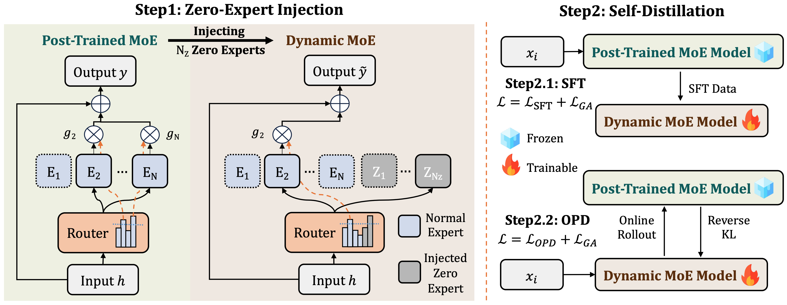
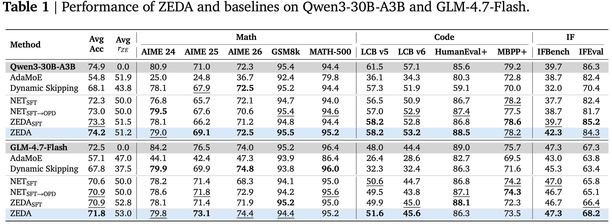
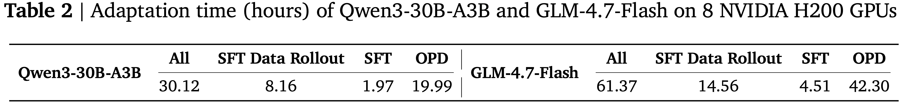
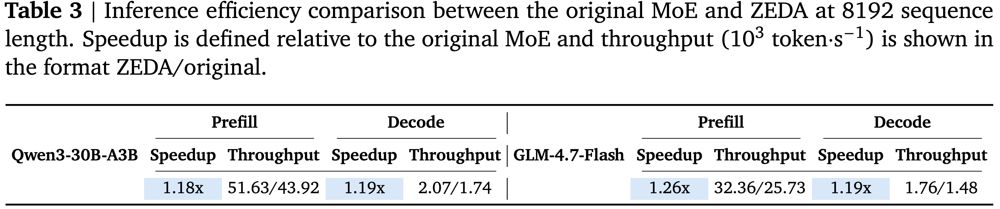

<div align="center">

# Post-Trained MoE Can Skip Half Experts via Self-Distillation

[](https://arxiv.org/abs/)  [](https://github.com/TsinghuaC3I/ZEDA) [](https://)

</div>

<div align="center" style="font-family: Arial, sans-serif;">
  <p>
    <a href="#news" style="text-decoration: none; font-weight: bold;">🎉 News</a> •
    <a href="#introduction" style="text-decoration: none; font-weight: bold;">📖 Introduction</a> •
    <a href="#zeda" style="text-decoration: none; font-weight: bold;">✨ ZEDA</a>
  </p>
  <p>
    <a href="#getting-started" style="text-decoration: none; font-weight: bold;">🚀 Getting Started</a> •
    <a href="#main-results" style="text-decoration: none; font-weight: bold;">📊 Main Results</a> •
    <a href="#acknowledgements" style="text-decoration: none; font-weight: bold;">💖 Acknowledgements</a> •
    <a href="#contact" style="text-decoration: none; font-weight: bold;">📨 Contact</a> •
    <a href="#citation" style="text-decoration: none; font-weight: bold;">🎈 Citation</a>
  </p>
</div>

> Fully trained Mixture-of-Experts (MoE) models are expensive to serve. Dynamic variant of MoE reduces computation by adjusting the activated experts in an input-dependent manner, while most existing dynamic MoE methods rely on pre-training from scratch or task-specific adaptation.
> 
> **In this paper, we introduce ZEDA, a low-cost framework that transforms post-trained static MoE models into efficient dynamic ones, eliminating over 50% of expert FLOPs at marginal accuracy loss.**

# 🎉News

- **[2026-05-19]** We introduce **Zero-Expert Self-Distillation Adaptation (ZEDA)**.

# 📖Introduction

We introduce **Zero-Expert Self-Distillation Adaptation (ZEDA)**, a low-cost framework that transforms post-trained static MoE models into efficient dynamic ones without substantially sacrificing their established capabilities. ZEDA targets the practical deployment scenario where MoE models have already undergone expensive pre-training and post-training, and further inference-cost reduction is desired after the main training pipeline is finalized. 

To stabilize this architectural conversion, ZEDA injects parameter-free zero-output experts into each MoE layer and adapts the augmented model through **two-stage self-distillation**, utilizing the original MoE as a frozen teacher and applying a **group-level balancing loss**. 
On Qwen3-30B-A3B and GLM-4.7-Flash across 11 benchmarks spanning math, code, and instruction following, ZEDA eliminates over 50% of expert FLOPs at marginal accuracy loss. It outperforms the strongest dynamic MoE baseline by 6.1 and 4.0 points on the two models, and delivers ~1.20× end-to-end inference speedup.

<p align="center">
   
</p>


# ✨ZEDA

> ZEDA first injects zero experts into a post-trained MoE, architecturally converting it into a dynamic one, and then adapts it through two-stage self-distillation with the original MoE as a fixed teacher.

ZEDA introduces parameterless zero experts, whose outputs are identically zero, into the existing expert pool of a post-trained MoE model. This expands the router candidate pool with zero-computation experts while the activation number remains unchanged, naturally reducing active normal experts. The augmented model is then adapted through a two-stage self-distillation process:
   - **SFT Stage**: Trains the student on responses sampled from the teacher (original MoE).
   - **OPD Stage**: Shifts to on-policy learning, where responses are sampled from the current student and the teacher supplies token-level targets via reverse KL.

ZEDA incorporates the Group Auxiliary Loss $\mathcal{L}_{GA}$ to regulate the relative activation frequency between normal experts and zero experts, while preserving the learned routing structures among normal experts. The loss is defined as:

```math
\mathcal{L}_{GA} = \alpha \cdot \frac{N + N_Z \cdot w}{K} \cdot \left( \frac{f_{\mathcal{E}} \cdot P_{\mathcal{E}}}{N} + \frac{f_{\mathcal{Z}} \cdot P_{\mathcal{Z}}}{N_Z \cdot w} \right)
```


# 🚀Getting Started

To run ZEDA, follow these steps:

### Env Setup

ZEDA is built upon large-scale MoE training and serving codebases, including [slime](https://github.com/THUDM/slime), [SGLang](https://github.com/sgl-project/sglang), and [Megatron](https://github.com/NVIDIA/Megatron-LM). Please use the Docker image [`slimerl/slime:20251113-v1`](https://hub.docker.com/r/slimerl/slime) released by [slime](https://github.com/THUDM/slime):
```bash
# Pull the image
docker pull slimerl/slime:20251113-v1

# Start the container
docker run --rm --gpus all --ipc=host --shm-size=16g \
  --ulimit memlock=-1 --ulimit stack=67108864 \
  -it slimerl/slime:latest /bin/bash
```


After pull and start the docker container, you simply need to install our modified versions of SGLang and slime:
```bash
cd sglang/python
pip install -e . --no-deps
git apply path-to-slime/docker/patch/latest/sglang.patch

cd slime
pip install -e . --no-deps
```

### Data Preparation

ZEDA uses 60k prompts including math, code, and chat data, and the corresponding self-distillation rollouts. 
  - **Prompts**: The prompts are used for rollout and OPD. The prompts are chosen from [AceReason-1.1-SFT](https://huggingface.co/datasets/nvidia/AceReason-1.1-SFT) and [Llama-Nemotron-Post-Training-Dataset](https://huggingface.co/datasets/nvidia/Llama-Nemotron-Post-Training-Dataset), and we release them in [xxx/xxx](https://).
  - **Rollouts**: The rollouts are used for SFT. You need to use the specific post-trained MoE model intended for adaptation to perform the rollout. If you are using Qwen3-30B-A3B or GLM-4.7-Flash as the original post-trained MoE model, you can directly utilize our released rollout results [xxx/xxx](https://).

After downloading the data, please put them in the `data` folder.


### Model Preparation

After downloading the specific post-trained MoE model intended for adaptation from Huggingface, please convert the model into a format compatible with Megatron:
```bash
xxx
```


### Training
ZEDA consists of zero-expert injection, SFT, and OPD. You can run the following scripts to start the adaptation pipeline:

```bash
# For Qwen3-30B-A3B
bash exp_scripts/train_zeda_qwen.sh # SFT
bash exp_scripts/train_zeda_qwen.sh # Convert Model
bash exp_scripts/train_zeda_qwen.sh # OPD

# For GLM-4.7-Flash
bash exp_scripts/train_zeda_glm.sh # SFT
bash exp_scripts/train_zeda_glm.sh # Convert Model
bash exp_scripts/train_zeda_glm.sh # OPD
```

### Models and Datasets

We release our adapted dynamic MoE models and rollout data in Huggingface:

| **Model**                          | **Huggingface** |  **Base Model** |
|-----------------------------------|------------------|------------------|
| Qwen3-30B-A3B-Dynamic | https://huggingface.co/ |  Qwen3-30B-A3B |
| GLM-4.7-Flash-Dynamic | https://huggingface.co/ | GLM-4.7-Flash |


| **Rollout Data**                          | **Huggingface** |
|-----------------------------------|------------------|
| Qwen3-30B-A3B-rollout-60k | https://huggingface.co/ |
| GLM-4.7-Flash-rollout-60k | https://huggingface.co/ |


# 📊Main Results

ZEDA demonstrates consistent improvements across multiple models and benchmarks:

<p align="center">
  
</p>
<p align="center">
  
</p>
<p align="center">
  
</p>

# 💖Acknowledgements
Our project mainly builds upon [slime](https://github.com/THUDM/slime), [SGLang](https://github.com/sgl-project/sglang), and [Megatron](https://github.com/NVIDIA/Megatron-LM). We leverage the datasets of [AceReason](https://huggingface.co/datasets/nvidia/AceReason-1.1-SFT) and [Llama-Nemotron-Post-Training-Dataset](https://huggingface.co/datasets/nvidia/Llama-Nemotron-Post-Training-Dataset), and backbone models of [Qwen3-30B-A3B](https://huggingface.co/Qwen/Qwen3-30B-A3B) and [GLM-4.7-Flash](https://huggingface.co/zai-org/GLM-4.7-Flash). We are grateful for these significant open-source contributions.

# 📨Contact

For questions about this work, please contact:

- Xingtai Lv: lvxt24@mails.tsinghua.edu.cn


# 🎈Citation

If you find this work helpful, please cite our paper:

```bibtex
```
